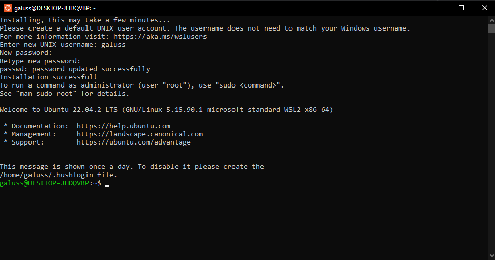
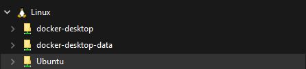
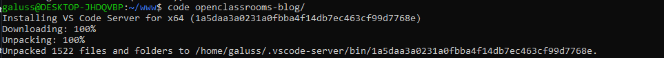
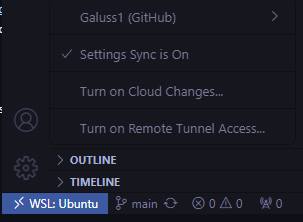
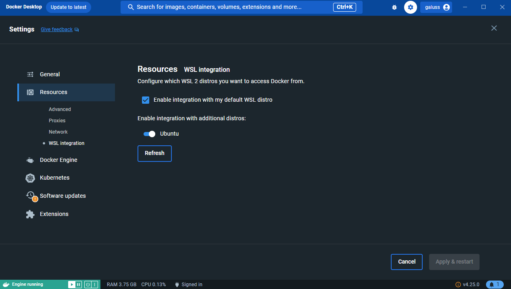
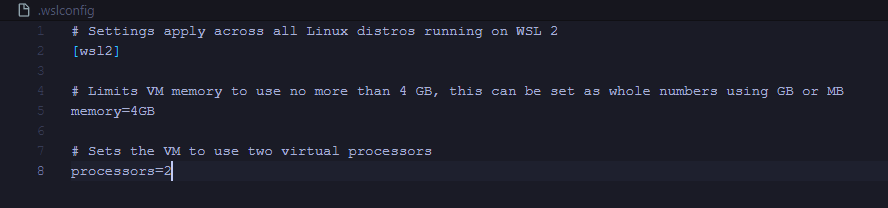

# Mise en place de l'environnement WSL2 (Ubuntu) pour Docker

## Introduction
Docker est un outil de conteneurisation qui permet aux développeurs de créer, déployer et exécuter des applications dans des environnements isolés appelés conteneurs. Il offre une grande portabilité et assure la consistance entre les environnements de développement et de production, simplifiant ainsi le processus de développement dans un projet informatique.\
WSL2 (Windows Subsystem for Linux version 2) est une fonctionnalité de Windows 10 et 11 permettant d'exécuter un environnement Linux directement sous Windows. Il combine la facilité d'utilisation de Windows avec la puissance et la flexibilité de Linux, offrant une compatibilité améliorée et des performances accrues pour les développeurs souhaitant utiliser des outils Linux sur leur machine Windows.

## Prérequis
- Installer [Docker Desktop](https://www.docker.com/products/docker-desktop/)
- Installer une distribution Linux depuis le Microsoft Store, Ubuntu dans cet exemple (installation en ligne de commande PowerShell également possible)
- Activer la fonctionnalité Windows "Plateforme de machine virtuelle" puis redémarer le PC (Pannneau de configuration -> Programmes -> Activer ou désactiver des fonctionnalités Windows)

## Installation

### Configuration de la distribution Linux
Lors du premier lancement l'environnement doit être installer et configurer.\
\
L'environnement est désormais accessible depuis l'explorateur de fichiers Windows ("\\wsl.localhost\Ubuntu").\
\
Créer un dossier de travail "home/username/www".\


### Mettre à jour l'environnement 
```bash
sudo apt update
```
```bash
sudo apt upgrade -y
```
```bash
sudo apt autoremove
```
```bash
sudo apt clean
```
Si les commandes sudo ne fonctionnent pas, suivez ce [guide](https://www.it-connect.fr/commande-sudo-comment-configurer-sudoers-sous-linux/).

### Ajouter une configuration personnalisée à la fin du fichier "home/username/.bashrc"
```bash
# Alias navigation
alias ..="cd .."
alias ...="cd ../.."
alias ....="cd ../../.."
alias ll="ls -lah"
alias la="ls -lAh"
alias l="ls -CF"

# Alias Git
alias gs="git status"
alias gl="git log --oneline --all --graph --decorate  $*"
alias glist="git config –global –list"
alias ga="git add"
alias gc="git commit"
alias gpush="git push"
alias gpull="git pull"
alias gd="git diff"
alias gch="git checkout"

# Alias Docker
alias dcompose="docker-compose"
alias dcomposebuild="docker-compose up --build"
alias dcomposeup="docker-compose up"
alias dcomposeupd="docker-compose up -d"
alias dcomposedown="docker-compose down"
```
Après avoir modifié le fichier il doit être rechargé avec la commande suivante :
```bash
. ~/.bashrc
```

### Configuration Git
Git est déjà installé par défaut sur la distribution Ubuntu.
```bash
git config --global user.name "Username"
```
```bash
git config --global user.email "username@email.com"
```
```bash
git config --global init.defaultBranch main
```
```bash
git config --global color.ui auto
```
```bash
git config --global core.autocrlf input
```

### Clés SSH GitHub
[Suivre ce guide](https://kinsta.com/blog/generate-ssh-key/)

### Configuration VS Code
Dans un premier temps [télécharger VS Code](https://code.visualstudio.com/) en local (Windows), ajouter l'extension WSL et connecter votre compte GitHub pour synchroniser vos paramètres.\
Il est également recommander d'utiliser les extensions Docker et Dev Containers.\
Cloner un projet (cela permet au passage de tester la connexion SSH précédement configurée).
```bash
git clone git@github.com:Username/project-name.git
```
Ouvrir le projet avec la commande ci-dessous, VS Code sera automatiquement installé lors du premier lancement et mise à jour si nécessaire par la suite.
```bash
code path/to/project-name
```
\
L'extension WSL devrait être active et votre compte GitHub a du être automatiquement connecté afin de synchroniser vos paramètres.\



### Configuration Docker Desktop
Ouvrir Docker Desktop et activer "WSL integration" en ajoutant la bonne distribution (ne pas oublier d'appliquer pour sauvegarder les changements).\
\
Conseil : Connecté vous avec votre compte [Docker Hub](https://hub.docker.com/) depuis Docker Desktop.

### Configuration WSL2
Afin d'éviter les chutes de performance, limiter les ressources allouées aux distributions WSL2.\
Créer un fichier ".wslconfig" depuis "Windows -> C:/Users/Username" et configurer ce fichier selon vos besoins.\


## Conclusion
L'environnement WSL2 est désormais correctement configuré pour utiliser Docker dans de bonnes conditions.\
Pour mettre en place l'environnement Docker [suivre ce guide.](docs/docker.md)
